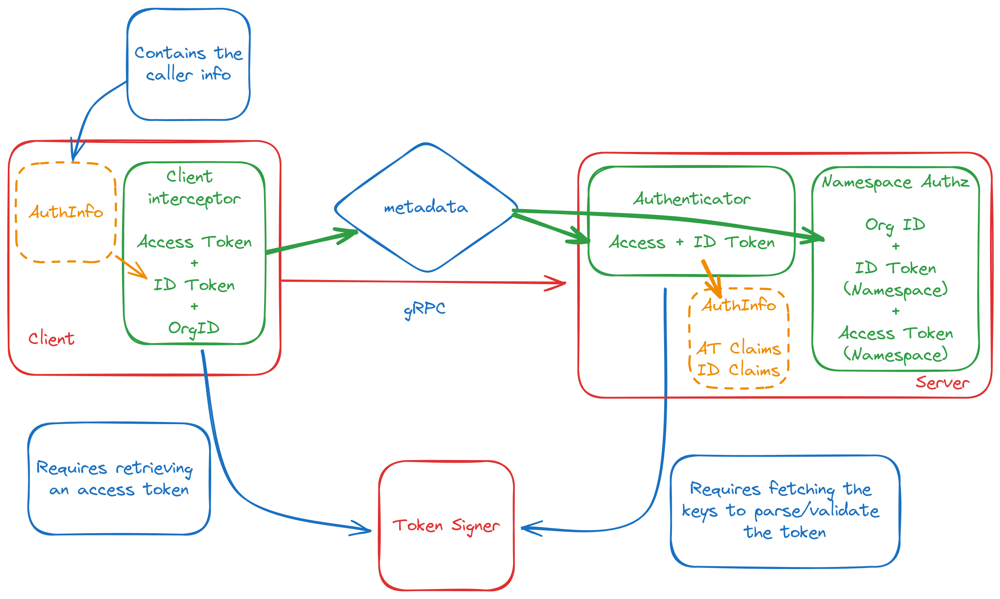

# Authlib

## Overview

The `Authlib` library provides a modular and secure approach to handling authentication and authorization within the Grafana ecosystem. It's designed to be flexible and easily adaptable to different deployment scenarios and integrates seamlessly with gRPC-based services.

### Key Features

- **Composability:** Deploy in various configurations: in-process, on-premises gRPC, or Cloud gRPC.
- **OAuth2-Inspired Security:** Leverages familiar JWT-based authentication and authorization for robust security.
- **Modular Design:** Built with three core packages:
  - **`claims`:** Abstracts token formats.
  - **[`authn`](./authn/README.md):** Manages token retrieval and verification:
    - Generic JWT verifier with support for custom claims
    - Specialized verifiers for Grafana ID Tokens and Access Tokens
    - Composable gRPC interceptors for retrieving, sending then verifying tokens in request metadata
  - **[`authz`](./authz/README.md):** Handles authorization logic:
    - Single-tenant RBAC client, typically used by plugins to query Grafana for user permissions and control their access.
    - **[unstable / under development]** Multi-tenant client, typically used by multi-tenant applications to enforce service and user access.
    - A composable namespace checker to authorize requests based on JWT namespaces

### Why Choose `Authlib`?

- **Seamless Grafana Integration:** Effortlessly secure communication between Grafana, your applications, and multi-tenant services.
- **Simplified Authentication & Authorization:** Focus on your application logic, not complex security implementations.
- **Flexible Deployment:** Adapt to our various deployments with ease.

## How it works for Grafana Plugins

<!-- TODO (gamab) Document and link -->

## How it works for Grafana Apps

The library leverages JWT (JSON Web Token) for secure communication and authorization, ensuring only authorized entities access resources.

1. **Component Identification:** Grafana, applications, and services identify themselves using JWT access tokens.
2. **Authentication:** Upon receiving requests, services verify the authenticity of the access token and also check if their own identifier (e.g., service name) is present in the token's audience list. This confirms the caller is authorized to interact with these specific services.
3. **Service Authorization:** Upon receiving requests, services verify the caller is allowed to access the requested resources namespace (e.g., `stacks-22`). Access tokens, contain a list of permitted actions (e.g., `datasources:write`, `folders:create`), that allow for finer-grained access control.
4. **Service Delegation (aka On-Behalf-Of):** Services can perform actions on behalf of users with provided access and ID tokens. Upon receiving requests, services verify both tokens namespace match the requested resources namespace. Access tokens, contain a list of permitted delegated actions (e.g. `teams:read`), that allow for finer-grained access control.

### 1. In-Process Deployment

**Diagram:**


**Code example**

```go
import (
    "github.com/fullstorydev/grpchan"
    "github.com/fullstorydev/grpchan/inprocgrpc"
    authnlib "github.com/grafana/authlib/authn"
    "github.com/grafana/authlib/claims"
    "github.com/grpc-ecosystem/go-grpc-middleware/v2/interceptors/auth"
    "google.golang.org/grpc"
)

// idTokenExtractor is a helper function to get the user ID Token from context
func idTokenExtractor(ctx context.Context) (string, error) {
    authInfo, ok := claims.From(ctx)
    if !ok {
        return "", fmt.Errorf("no claims found")
    }

    extra := authInfo.GetExtra()
    if token, exists := extra["id-token"]; exists && len(token) != 0 && token[0] != "" {
        return token[0], nil
    }

    return "", fmt.Errorf("id-token not found")
}

func main() {
    // Use grpc over go channels
    channel := &inprocgrpc.Channel{}

    // A grpc service
    service := MyService{}

    // For in-process communications, this authenticator bypasses
    // ID token signature checks, requiring only a valid ID token.
    authenticator := authnlib.NewUnsafeGrpcAuthenticator(
        &authnlib.GrpcAuthenticatorConfig{},
        authnlib.WithDisableAccessTokenAuthOption(),
        authnlib.WithIDTokenAuthOption(true),
    )

    // Instantiate the server side of the grpc channel
    channel.RegisterService(
        grpchan.InterceptServer(
            &MyService_ServiceDesc,
            auth.UnaryServerInterceptor(authenticator.Authenticate),
            auth.StreamServerInterceptor(authenticator.Authenticate),
        ),
        service,
    )

    // For in-process communications, the client side adds id-tokens
    // to the metadata of the outgoing context
    clientInt, _ := authnlib.NewGrpcClientInterceptor(
        &authnlib.GrpcClientConfig{},
        authnlib.WithDisableAccessTokenOption(),
        authnlib.WithIDTokenExtractorOption(idTokenExtractor),
    )

    // Instantiate the client side of the grpc channel
    conn := grpchan.InterceptClientConn(channel, clientInt.UnaryClientInterceptor, clientInt.StreamClientInterceptor))

    // ...
}
```

### 2. Remote gRPC Deployment

**Diagram:**



**Code Example - Server side:**

```go
import (
    authnlib "github.com/grafana/authlib/authn"
    authzlib "github.com/grafana/authlib/authz"
    "github.com/grafana/authlib/claims"
    "github.com/grpc-ecosystem/go-grpc-middleware/v2/interceptors/auth"
    "google.golang.org/grpc"
)

func main() (*authnlib.GrpcAuthenticator, error) {
    // A grpc service
    service := MyService{}

    // For remote communication, this authenticator ensures secure access by:
    //  1. Validating ID and access tokens against the signing server's keys.
    //  2. Verifying this service's identifier is present in the access token's
    //     audience list, confirming intended authorization.
    authenticator := authnlib.NewGrpcAuthenticator(
        &authnlib.GrpcAuthenticatorConfig{
            KeyRetrieverConfig: authnlib.KeyRetrieverConfig{
                SigningKeysURL: "https://token-signer/v1/keys",
            },
            VerifierConfig: authnlib.VerifierConfig{
                AllowedAudiences: []string{"MyService"},
            },
        },
        authnlib.WithIDTokenAuthOption(true),
    )

    //  Beyond token verification, this enforces access control at the
    //  namespace level. Only authorized users/services can access
    //  resources within a given namespace.
    namespaceAuthz = authzlib.NamespaceAuthorizationFunc(
        // The checker will verify both access and id token
        // are authorized to access the namespace.
		authzlib.NewNamespaceAccessChecker(
            claims.CloudNamespaceFormatter,
            authzlib.WithIDTokenNamespaceAccessCheckerOption(true),
        ),
        // Method to extract the namespace that is being targeted.
        // Here we use gRPC metadata.
		authzlib.MetadataStackIDExtractor(authzlib.DefaultStackIDMetadataKey),
	)

    // Create a new grpc server
    server = grpc.NewServer(
        grpc.ChainUnaryInterceptor(
            auth.UnaryServerInterceptor(authenticator.Authenticate),
            authzlib.UnaryAuthorizeInterceptor(namespaceAuthz),
        ),
        grpc.ChainStreamInterceptor(
            auth.StreamServerInterceptor(authenticator.Authenticate),
            authzlib.StreamAuthorizeInterceptor(namespaceAuthz),
        ),
    )
    server.RegisterService(&authzv1.MyService_ServiceDesc, service)

    // ...
}
```

**Code Example - Client side:**

```go
import (
    authnlib "github.com/grafana/authlib/authn"
    authzlib "github.com/grafana/authlib/authz"
    "github.com/grafana/authlib/claims"
    "google.golang.org/grpc"
)

// idTokenExtractor is a helper function to get the user ID Token from context
func idTokenExtractor(ctx context.Context) (string, error) {
    authInfo, ok := claims.From(ctx)
    if !ok {
        return "", fmt.Errorf("no claims found")
    }

    extra := authInfo.GetExtra()
    if token, exists := extra["id-token"]; exists && len(token) != 0 && token[0] != "" {
        return token[0], nil
    }

    return "", fmt.Errorf("id-token not found")
}

// stackIdExtractor is a helper function used to populate gRPC metadata with the StackID
func stackIdExtractor(ctx context.Context) (key string, values []string, err error) {
	return authzlib.DefaultStackIDMetadataKey, []string{"22"}, nil
}

func main() {
    // The client interceptor authenticates requests to the gRPC server using
	// the provided TokenExchangeConfig. It automatically handles token exchange
	// and injects the ID token along with the extracted StackID into the request metadata.
	clientInt, err := authnlib.NewGrpcClientInterceptor(
        &authnlib.GrpcClientConfig{
            TokenClientConfig: &authnlib.TokenExchangeConfig{
                Token:            "myClientToken",
                TokenExchangeURL: "https://token-signer/v1/sign-access-token",
            },
            TokenRequest: &authnlib.TokenExchangeRequest{
                Namespace: "stacks-22",
                Audiences: []string{"MyService"},
            },
        },
		authnlib.WithIDTokenExtractorOption(idTokenExtractor),
		authnlib.WithMetadataExtractorOption(stackIdExtractor),
    )
	if err != nil {
		os.Exit(1)
	}

	conn, err := grpc.NewClient(
        "myService:10000",
        grpc.WithUnaryInterceptor(clientInt.UnaryClientInterceptor),
        grpc.WithStreamInterceptor(clientInt.StreamClientInterceptor),
    )

    // ...
}
```

### License

This project is licensed under the Apache-2.0 license - see the [LICENSE](LICENSE) file for details.
