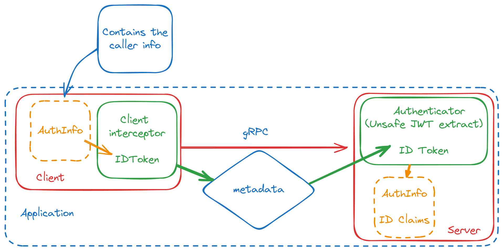

# Authlib

## Overview

The `Authlib` library provides a modular and secure approach to handling authentication and authorization within the Grafana ecosystem. It's designed to be flexible and easily adaptable to different deployment scenarios and integrates seamlessly with gRPC-based services.

### Key Features

- **Composability:** Deploy in various configurations: in-process, on-premises gRPC, or Cloud gRPC.
- **OAuth2-Inspired Security:** Leverages familiar JWT-based authentication and authorization for robust security.
- **Modular Design:** Built with three core packages:
  - **`claims`:** Abstracts token formats.
  - **[`authn`](./authn/README.md):** Manages token retrieval and verification:
    - Generic JWT verifier with support for custom claims
    - Specialized verifiers for Grafana ID Tokens and Access Tokens
    - Composable gRPC interceptors for retrieving, sending then verifying tokens in request metadata
  - **[`authz`](./authz/README.md):** Handles authorization logic:
    - Single-tenant RBAC client, typically used by plugins to query Grafana for user permissions and control their access.
    - **[unstable / under development]** Multi-tenant client, typically used by multi-tenant applications to enforce service and user access.

### Why Choose `Authlib`?

- **Seamless Grafana Integration:** Effortlessly secure communication between Grafana, your applications, and multi-tenant services.
- **Simplified Authentication & Authorization:** Focus on your application logic, not complex security implementations.
- **Flexible Deployment:** Adapt to our various deployments with ease.

## How it works for Grafana Plugins

This library empowers your Grafana plugins with straightforward access control mechanisms using the `EnforcementClient`. This client simplifies the enforcement of Grafana's Role-Based Access Control (RBAC) within your plugin.

**Implementation Guidance:**

For a comprehensive guide on implementing RBAC access control in your Grafana plugins, refer to our detailed example: [https://github.com/grafana/grafana-plugin-examples/blob/main/examples/app-with-rbac/README.md](https://github.com/grafana/grafana-plugin-examples/blob/main/examples/app-with-rbac/README.md).

## How it works for Grafana Apps

The library leverages JWT (JSON Web Token) for secure communication and authorization, ensuring only authorized entities access resources.

1. **Component Identification:** Grafana, applications, and services identify themselves using JWT access tokens.
2. **Authentication:** Upon receiving requests, services verify the authenticity of the access token and also check if their own identifier (e.g., service name) is present in the token's audience list. This confirms the caller is authorized to interact with these specific services.
3. **Service Authorization:** Upon receiving requests, services verify that Access tokens contain a list of permitted actions (e.g. `dashboard.grafana.app/dashboards:read`), that allow for finer-grained access control.
4. **Service Delegation (aka On-Behalf-Of):** Services can perform actions on behalf of users with provided access and ID tokens. Upon receiving requests, services verify both tokens namespace match the requested resources namespace. Access tokens, contain a list of permitted delegated actions (e.g. `iam.grafana.app/teams:read`), that allow for finer-grained access control.

### 1. In-Process Grpc Deployment

**Diagram:**



**Code example **

```go
import (
	"context"
	"errors"
	"fmt"

	"github.com/fullstorydev/grpchan"
	"github.com/fullstorydev/grpchan/inprocgrpc"
	grpcAuth "github.com/grpc-ecosystem/go-grpc-middleware/v2/interceptors/auth"
	"google.golang.org/grpc/codes"
	"google.golang.org/grpc/metadata"
	"google.golang.org/grpc/status"

	"github.com/grafana/authlib/authn"
	"github.com/grafana/authlib/types"
)


// idTokenExtractor is a helper function to get the user ID Token from context
func idTokenExtractor(ctx context.Context) (string, error) {
	info, ok := types.AuthInfoFrom(ctx)
	if !ok {
		return "", fmt.Errorf("no claims found")
	}

	if token := info.GetIDToken(); len(token) != 0 {
		return token, nil
	}

	return "", fmt.Errorf("id-token not found")
}

func main() {
	channel := &inprocgrpc.Channel{}
	service := MyService{}

	// For in-process communications, this authenticator bypasses
	// token signature checks but validate that they otherwise
	// are correct.
	authenticator := authn.NewDefaultAuthenticator(
		authn.NewUnsafeAccessTokenVerifier(authn.VerifierConfig{}),
		authn.NewUnsafeIDTokenVerifier(authn.VerifierConfig{}),
	)

	// Create a function that can be used by grpcAuth server interceptors.
	authfn := func(ctx context.Context) (context.Context, error) {
		md, ok := metadata.FromIncomingContext(ctx)
		if !ok {
			return nil, errors.New("missing metedata in context")
		}

		info, err := authenticator.Authenticate(ctx, authn.NewGRPCTokenProvider(md))
		if err != nil {
			if authn.IsUnauthenticatedErr(err) {
				return nil, status.Error(codes.Unauthenticated, err.Error())
			}

			return ctx, status.Error(codes.Internal, err.Error())
		}

		return types.WithAuthInfo(ctx, info), nil
	}

	// Instantiate the server side of the grpc channel
	channel.RegisterService(
		grpchan.InterceptServer(
			&MyService_ServiceDesc,
			grpcAuth.UnaryServerInterceptor(authfn),
			grpcAuth.StreamServerInterceptor(authfn),
		),
		service,
	)

	// For in-process communications, the client side adds id-tokens
	// to the metadata of the outgoing context
	clientInt := authn.NewGrpcClientInterceptor(
		authn.NewStaticTokenExchanger("some-token"),
		authn.WithClientInterceptorAudience([]string{"target-audience"}),
		authn.WithClientInterceptorNamespace("target-namespace"),
	)

	// Instantiate the client side of the grpc channel
	conn := grpchan.InterceptClientConn(channel, clientInt.UnaryClientInterceptor, clientInt.StreamClientInterceptor)

	// ...
}
```

### 2. Remote gRPC Deployment

**Diagram:**


**Code Example - Server side:**

```go
import (
	"context"
	"errors"

	"google.golang.org/grpc"
	"google.golang.org/grpc/codes"
	"google.golang.org/grpc/metadata"
	"google.golang.org/grpc/status"

	"github.com/grafana/authlib/authn"
	"github.com/grafana/authlib/types"
	"github.com/grpc-ecosystem/go-grpc-middleware/v2/interceptors/auth"
)

func main() {
	// A grpc service
	service := MyService{}

	// Setup a key retriver. This is used to fetch and cache
	// public keys used to verify tokens.
	ks := authn.NewKeyRetriever(authn.KeyRetrieverConfig{
		SigningKeysURL: "url-to-fetch-public-keys-from",
	})

	// For remote communication, this authenticator ensures secure access by:
	//  1. Validating ID and access tokens against the signing server's keys.
	//  2. Verifying this service's identifier is present in the access token's
	//     audience list, confirming intended authorization.
	authenticator := authn.NewDefaultAuthenticator(
		authn.NewAccessTokenVerifier(authn.VerifierConfig{
			AllowedAudiences: []string{"required-audience"},
		}, ks),
		authn.NewIDTokenVerifier(authn.VerifierConfig{}, ks),
	)

	// Create a function that can be used by grpcAuth server interceptors.
	// On success this will set AuthInfo in context and types.AuthInfoFrom(ctx)
	// can be used to extract it.
	authfn := func(ctx context.Context) (context.Context, error) {
		md, ok := metadata.FromIncomingContext(ctx)
		if !ok {
			return nil, errors.New("missing metedata in context")
		}

		info, err := authenticator.Authenticate(ctx, authn.NewGRPCTokenProvider(md))
		if err != nil {
			if authn.IsUnauthenticatedErr(err) {
				return nil, status.Error(codes.Unauthenticated, err.Error())
			}

			return ctx, status.Error(codes.Internal, err.Error())
		}

		return types.WithAuthInfo(ctx, info), nil
	}

	// Create a new grpc server
	server := grpc.NewServer(
		grpc.ChainUnaryInterceptor(
			auth.UnaryServerInterceptor(authfn),
		),
		grpc.ChainStreamInterceptor(
			auth.StreamServerInterceptor(authfn),
		),
	)
	server.RegisterService(&MyService_ServiceDesc, service)

	// ...
}
```

**Code Example - Client side:**

```go
// idTokenExtractor is a helper function to get the user ID Token from context
func idTokenExtractor(ctx context.Context) (string, error) {
	info, ok := types.AuthInfoFrom(ctx)
	if !ok {
		return "", fmt.Errorf("no claims found")
	}

	if token := info.GetIDToken(); len(token) != 0 {
		return token, nil
	}

	return "", fmt.Errorf("id-token not found")
}

func main() {
	// A token exchanger is used to exhange a provisioned token against
	// a Access token.
	ts, err := authn.NewTokenExchangeClient(authn.TokenExchangeConfig{
		Token:            "my-token",
		TokenExchangeURL: "my-token-exhange-url",
	})
	if err != nil {
		panic(err)
	}

	// The client interceptor authenticates requests to the gRPC server using
	// the provided TokenExchangeConfig. It automatically handles token exchange
	// and injects the ID token.
	clientInt := authn.NewGrpcClientInterceptor(
		ts,
		authn.WithClientInterceptorAudience([]string{"target-audience"}),
		authn.WithClientInterceptorNamespace("target-namespace"),
		authn.WithClientInterceptorIDTokenExtractor(idTokenExtractor),
	)

	// Setup grpc server with interceptors that can validate authentication.
	conn, err := grpc.NewClient(
		"myService:10000",
		grpc.WithUnaryInterceptor(clientInt.UnaryClientInterceptor),
		grpc.WithStreamInterceptor(clientInt.StreamClientInterceptor),
	)
}
```

### License

This project is licensed under the Apache-2.0 license - see the [LICENSE](LICENSE) file for details.
