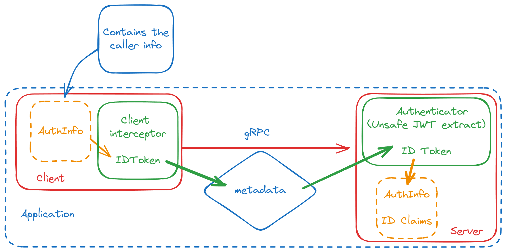

# Authlib

## Overview

The `Authlib` library provides a modular and secure approach to handling authentication and authorization within the Grafana ecosystem. It's designed to be flexible and easily adaptable to different deployment scenarios and integrates seamlessly with gRPC-based services.

### Key Features

- **Composability:** Deploy in various configurations: in-process, on-premises gRPC, or Cloud gRPC.
- **OAuth2-Inspired Security:** Leverages familiar JWT-based authentication and authorization for robust security.
- **Modular Design:** Built with three core packages:
  - **`claims`:** Abstracts token formats.
  - **`authz`:** Handles authorization logic ([See Readme for more details](./authn/README.md)):
    - Single-tenant RBAC client. For plugins to query Grafana for user permissions and control their access.
    - **[unstable / under development]** Multi-tenant client, typically used by multi-tenant applications to enforce service and user access.
    - A composable namespace checker to authorize requests based on JWT namespaces
  - **`authn`:** Manages token retrieval and verification ([See Readme for more details](./authz/README.md)):
    - Generic JWT verifier with support for custom claims
    - Specialized verifiers for Grafana ID Tokens and Access Tokens
    - Composable gRPC interceptors for retrieving/adding and verifying tokens in request metadata

### Why Choose `Authlib`?

- **Seamless Grafana Integration:** Effortlessly secure communication between Grafana, your applications, and multi-tenant services.
- **Simplified Authentication & Authorization:** Focus on your application logic, not complex security implementations.
- **Flexible Deployment:** Adapt to our various deployments with ease.

## Deployment Scenarios & Examples

The library leverages JWT (JSON Web Token) for secure communication and authorization, ensuring only authorized entities access resources.

### How it works

1. **Component Identification:** Grafana, applications, and services identify themselves using JWT access tokens.
2. **Authentication:** Upon receiving requests, services verify the authenticity of the access token and ensure the caller (identified by the "audience" field) is authorized.
3. **Service Authorization:** Upon receiving requests, services verify the caller is allowed to access the requested resources namespace. Access tokens, contain a list of permitted actions (e.g., `datasources:write`, `folders:create`), that allow for finer-grained access control.
4. **Service Delegation:** Services can perform actions on behalf of users with provided access and ID tokens. Upon receiving requests, services verify both tokens namespace match the requested resources namespace. Access tokens, contain a list of permitted delegated actions (e.g. `teams:read`), that allow for finer-grained access control.

### 1. In-Process Deployment

**Diagram:**



**Code example**

```go
import (
    "github.com/fullstorydev/grpchan"
    "github.com/fullstorydev/grpchan/inprocgrpc"
    authnlib "github.com/grafana/authlib/authn"
    "github.com/grafana/authlib/claims"
    "github.com/grpc-ecosystem/go-grpc-middleware/v2/interceptors/auth"
    "google.golang.org/grpc"
)

func idTokenExtractor(ctx context.Context) (string, error) {
    authInfo, ok := claims.From(ctx)
    if !ok {
        return "", fmt.Errorf("no claims found")
    }

    extra := authInfo.GetExtra()
    if token, exists := extra["id-token"]; exists && len(token) != 0 && token[0] != "" {
        return token[0], nil
    }

    return "", fmt.Errorf("id-token not found")
}

func main() {
    // Use grpc over go channels
    channel := &inprocgrpc.Channel{}

    // A grpc service
    server := MyService{}

    // For in-process communications, this authenticator bypasses
    // ID token signature checks, requiring only a valid ID token.
    authenticator := authnlib.NewUnsafeGrpcAuthenticator(
        &authnlib.GrpcAuthenticatorConfig{},
        authnlib.WithDisableAccessTokenAuthOption(),
        authnlib.WithIDTokenAuthOption(true),
    )

    // Instantiate the server side of the grpc channel
    channel.RegisterService(
        grpchan.InterceptServer(
            &MyService_ServiceDesc,
            auth.UnaryServerInterceptor(authenticator.Authenticate),
            auth.StreamServerInterceptor(authenticator.Authenticate),
        ),
        server,
    )

    // For in-process communications, the client side adds id-tokens
    // to the metadata of the outgoing context
    clientInt, _ := authnlib.NewGrpcClientInterceptor(
        &authnlib.GrpcClientConfig{},
        authnlib.WithDisableAccessTokenOption(),
        authnlib.WithIDTokenExtractorOption(idTokenExtractor),
    )

    // Instantiate the client side of the grpc channel
    conn := grpchan.InterceptClientConn(channel, clientInt.UnaryClientInterceptor, clientInt.StreamClientInterceptor))
}
```

#### 2. On-Premise gRPC Deployment

**Diagram:**

[Insert Diagram for On-Premise gRPC Deployment]

**Code Example:**

```
// Example: On-premise gRPC communication using the library
// ... Code snippet demonstrating on-premise gRPC communication ...
```

#### 3. Cloud gRPC Deployment

**Diagram:**

[Insert Diagram for Cloud gRPC Deployment]

**Code Example:**

```
// Example: Cloud gRPC communication using the library
// ... Code snippet demonstrating Cloud gRPC communication ...
```

### Getting Started

[Provide concise and clear instructions on how to get started with the library, including installation, configuration, and usage examples.]

### Documentation

For detailed information and advanced usage, please refer to our comprehensive documentation: [Link to Documentation]

### Contributing

We welcome contributions! See our [CONTRIBUTING.md](CONTRIBUTING.md) for guidelines.

### License

This project is licensed under the [License Name] - see the [LICENSE](LICENSE) file for details.
