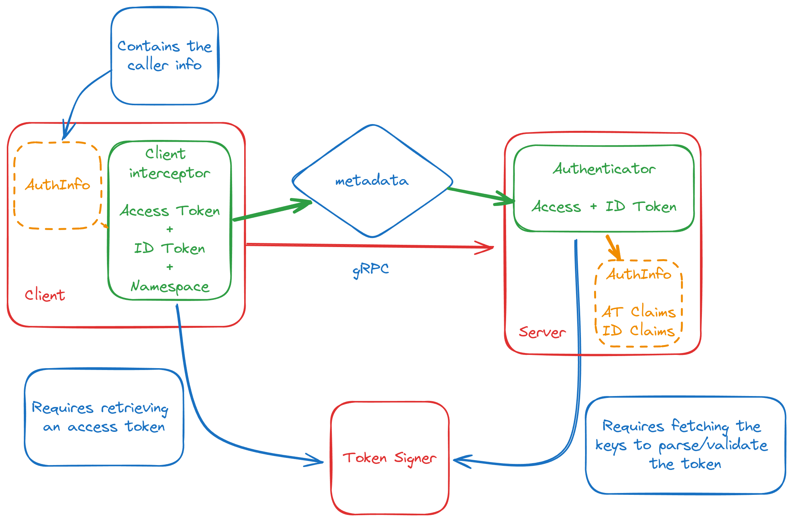

# Authn: Robust JWT Verification for the Grafana Ecosystem

This library provides a robust and flexible way to verify JSON Web Tokens (JWTs) within the Grafana ecosystem.

**Features**:

- Generic JWT verifier with support for custom claims
- Specialized verifiers for Grafana ID Tokens and Access Tokens
- Composable gRPC interceptors for retrieving, sending then verifying tokens in request metadata

## Token verifier

This package will handle retrival and caching of jwks. It was desing to be generic over "Custom claims" so that we are not only restricted to the current structure of id tokens. This means that the parsed claims will contain standard jwts claims such as `aud`, `exp` etc plus specified custom types.

```go
package main

import (
	"context"
	"log"

	"github.com/grafana/authlib/authn"
)

type CustomClaims struct{}

func main() {
	verifier := authn.NewVerifier[CustomClaims](authn.VerifierConfig{
		AllowedAudiences: []string{},
	}, authn.TokenTypeID, authn.NewKeyRetiever(KeyRetrieverConfig{SigningKeysURL: "<jwks url>"}))

	claims, err := verifier.Verify(context.Background(), "<token>")

	if err != nil {
		log.Fatal("failed to verify id token: ", err)
	}

	log.Println("Claims: ", claims)
}
```

The verifier is generic over jwt.Claims. Most common use cases will be to either verify Grafana issued ID-Token or Access token.
For those we have `AccessTokenVerifier` and `IDTokenVerifier`. These two structures are just simple wrappers around `Verifier` with expected types.

## gRPC interceptors

This package simplifies the implementation of authentication within your gRPC services operating within the Grafana ecosystem.

**Key Components:**

- **Client-Side Interceptor**: Request access tokens from the Token Signing Server and enrich your gRPC requests with necessary metadata. This modular interceptor allows you to customize the added metadata based on your specific service requirements (e.g: user ID token, requested namespace).
- **Server-Side Authenticator**: Easily verify the validity of access tokens (and optionally ID tokens) against the Token Signing Server's public keys. This authenticator integrates directly with the standard grpc-ecosystem/go-grpc-middleware/auth interceptor for straightforward implementation.

### Example: Full authentication example with ID and Access Tokens

In this first example:

- We configure the client interceptor to interact with the `MyService` gRPC service. This interceptor uses its own `myClientToken` to request an access token from the token signing service at "/v1/sign-access-token". The requested access token will grant access to the `MyService` for the `stacks-22` namespace. The interceptor will also add the incoming user's ID token to the metadata, along with the query namespace using the `X-Namespace` key. We assume that `MyService` requires this additional Namespace metadata to determine which tenant is being queried.
- On the server side, we set up the interceptor for the `MyService` service. This interceptor extracts the access and ID tokens from the gRPC metadata. It then populates the application context with an `AuthInfo` object. Functions within `MyService` can use this `AuthInfo` object to access information about the caller (such as their permissions).

**Diagram:**



**Client side:**

```go
package main

import (
	"context"
	"fmt"

	"google.golang.org/grpc"

	"github.com/grafana/authlib/authn"
	"github.com/grafana/authlib/types"
)

// idTokenExtractor is a helper function to get the user ID Token from context
func idTokenExtractor(ctx context.Context) (string, error) {
	info, ok := types.AuthInfoFrom(ctx)
	if !ok {
		return "", fmt.Errorf("no claims found")
	}

	if token := info.GetIDToken(); len(token) != 0 {
		return token, nil
	}

	return "", fmt.Errorf("id-token not found")
}

func main() {
	// A token exchanger is used to exhange a provisioned token against
	// a Access token.
	ts, err := authn.NewTokenExchangeClient(authn.TokenExchangeConfig{
		Token:            "my-token",
		TokenExchangeURL: "my-token-exhange-url",
	})
	if err != nil {
		panic(err)
	}

	// The client interceptor authenticates requests to the gRPC server using
	// the provided TokenExchangeConfig. It automatically handles token exchange
	// and injects the ID token.
	clientInt := authn.NewGrpcClientInterceptor(
		ts,
		authn.WithClientInterceptorAudience([]string{"target-audience"}),
		authn.WithClientInterceptorNamespace("target-namespace"),
		authn.WithClientInterceptorIDTokenExtractor(idTokenExtractor),
	)

	// Setup grpc server with interceptors that can validate authentication.
	conn, err := grpc.NewClient(
		"myService:10000",
		grpc.WithUnaryInterceptor(clientInt.UnaryClientInterceptor),
		grpc.WithStreamInterceptor(clientInt.StreamClientInterceptor),
	)
}
```

**Server side:**

```go
package main

import (
	"context"
	"errors"

	"google.golang.org/grpc"
	"google.golang.org/grpc/codes"
	"google.golang.org/grpc/metadata"
	"google.golang.org/grpc/status"

	"github.com/grafana/authlib/authn"
	"github.com/grafana/authlib/types"
	"github.com/grpc-ecosystem/go-grpc-middleware/v2/interceptors/auth"
)

func main() {
	// A grpc service
	service := MyService{}

	// Setup a key retriver. This is used to fetch and cache
	// public keys used to verify tokens.
	ks := authn.NewKeyRetriever(authn.KeyRetrieverConfig{
		SigningKeysURL: "url-to-fetch-public-keys-from",
	})

	// For remote communication, this authenticator ensures secure access by:
	//  1. Validating ID and access tokens against the signing server's keys.
	//  2. Verifying this service's identifier is present in the access token's
	//     audience list, confirming intended authorization.
	authenticator := authn.NewDefaultAuthenticator(
		authn.NewAccessTokenVerifier(authn.VerifierConfig{
			AllowedAudiences: []string{"required-audience"},
		}, ks),
		authn.NewIDTokenVerifier(authn.VerifierConfig{}, ks),
	)

	// Create a function that can be used by grpcAuth server interceptors.
	// On success this will set AuthInfo in context and types.AuthInfoFrom(ctx)
	// can be used to extract it.
	authfn := func(ctx context.Context) (context.Context, error) {
		md, ok := metadata.FromIncomingContext(ctx)
		if !ok {
			return nil, errors.New("missing metedata in context")
		}

		info, err := authenticator.Authenticate(ctx, authn.NewGRPCTokenProvider(md))
		if err != nil {
			if authn.IsUnauthenticatedErr(err) {
				return nil, status.Error(codes.Unauthenticated, err.Error())
			}

			return ctx, status.Error(codes.Internal, err.Error())
		}

		return types.WithAuthInfo(ctx, info), nil
	}

	// Create a new grpc server
	server := grpc.NewServer(
		grpc.ChainUnaryInterceptor(
			auth.UnaryServerInterceptor(authfn),
		),
		grpc.ChainStreamInterceptor(
			auth.StreamServerInterceptor(authfn),
		),
	)
	server.RegisterService(&MyService_ServiceDesc, service)

	// ...
}
```
